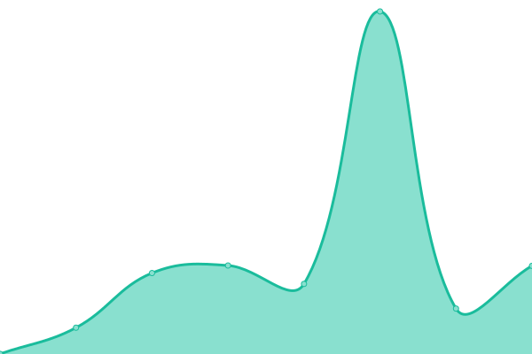
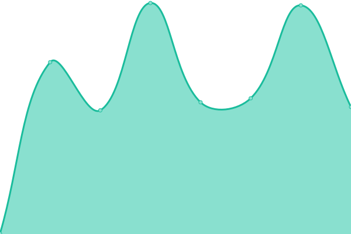

# [📈 Live Status](https://status.gearheads.social): <!--live status--> **🟩 All systems operational**

This repository contains the open-source uptime monitor and status page for [Zio](https://zio.sh), powered by [Upptime](https://github.com/upptime/upptime).

With [Upptime](https://upptime.js.org), you can get your own unlimited and free uptime monitor and status page, powered entirely by a GitHub repository. We use [Issues](https://github.com/ziodotsh/upptime-gearheads.social/issues) as incident reports, [Actions](https://github.com/ziodotsh/upptime-gearheads.social/actions) as uptime monitors, and [Pages](https://status.gearheads.social) for the status page.

<!--start: status pages-->
<!-- This summary is generated by Upptime (https://github.com/upptime/upptime) -->
<!-- Do not edit this manually, your changes will be overwritten -->
<!-- prettier-ignore -->
| URL | Status | History | Response Time | Uptime |
| --- | ------ | ------- | ------------- | ------ |
|  [Mastodon](https://gearheads.social) | 🟩 Up | [mastodon.yml](https://github.com/ziodotsh/upptime-gearheads.social/commits/HEAD/history/mastodon.yml) | 

 576ms
     
 | 

<a href="https://status.gearheads.social/history/mastodon">100.00%</a>
    

|  [Mastodon API](https://gearheads.social/api/v2/instance) | 🟩 Up | [mastodon-api.yml](https://github.com/ziodotsh/upptime-gearheads.social/commits/HEAD/history/mastodon-api.yml) | 

 154ms
     
 | 

<a href="https://status.gearheads.social/history/mastodon-api">100.00%</a>
    

|  [CDN](https://cdn.gearheads.social/check.txt) | 🟩 Up | [cdn.yml](https://github.com/ziodotsh/upptime-gearheads.social/commits/HEAD/history/cdn.yml) | 

 696ms
     
 | 

<a href="https://status.gearheads.social/history/cdn">100.00%</a>
    

|  [Relay](https://relay.gearheads.social) | 🟩 Up | [relay.yml](https://github.com/ziodotsh/upptime-gearheads.social/commits/HEAD/history/relay.yml) | 

 458ms
     
 | 

<a href="https://status.gearheads.social/history/relay">100.00%</a>
    

|  [Elk](https://elk.gearheads.social) | 🟩 Up | [elk.yml](https://github.com/ziodotsh/upptime-gearheads.social/commits/HEAD/history/elk.yml) | 

 673ms
     
 | 

<a href="https://status.gearheads.social/history/elk">100.00%</a>
    

<!--end: status pages-->

[**Visit our status website →**](https://status.gearheads.social)

## 📄 License

- Powered by: [Upptime](https://github.com/upptime/upptime)
- Code: [MIT](./LICENSE) © [Zio](https://zio.sh)
- Data in the `./history` directory: [Open Database License](https://opendatacommons.org/licenses/odbl/1-0/)
